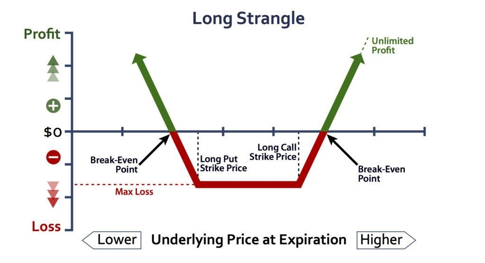
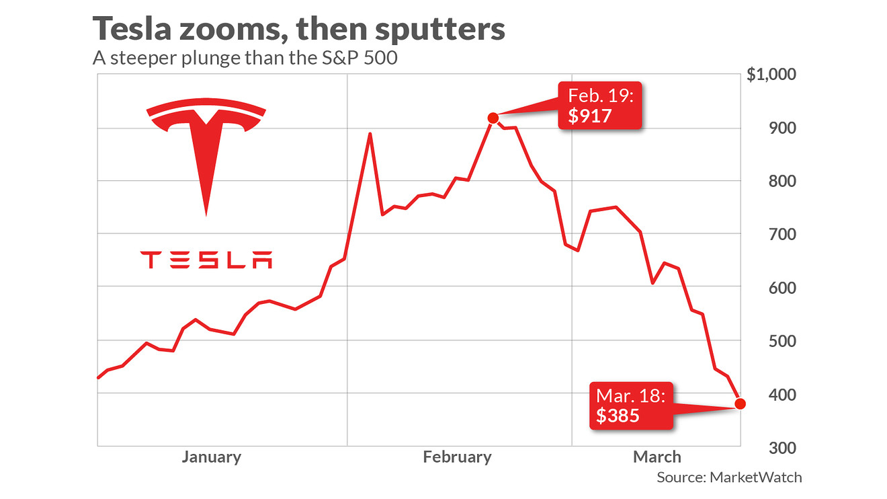

```{r setup, include=FALSE}
knitr::opts_chunk$set(echo = TRUE)
```

# Objective
The goal of this project is to find a fair price of the *long strangle* option strategy, using Geometric Asian Options.
A Monte Carlo approach is necessary, because it is not possible to determine the price analytically. 
There exist some solutions that will give approximate prices, but only Monte Carlo will
find them with arbitrally precision (*theoretically*, given enough computational power). 

# Assumptions
Following assumptions are set:    

- Annualized volatility rate: 25%
- Annualized risk-free rate: 7%
- Number of Monte Carlo rounds per each variant: 10 000
- Working days in a year: 252
- Prices change once per day
- Minimal time to maturity: 1 day
- No limit on the maximal time to maturity (for practical values)

# Portfolio
Price of underlying instrument is 75. Chosen spread between underlying price and strike is 5.  

The portfolio will contain: 

- One geometric Asian long call option with strike price of 80
- One geometric Asian long put option with strike price of 70

The time to maturity will be 252 working days, exactly one year.   

The *long strangle* option strategy is in interesting construct, allowing the person to benefit from 
significant changes in the price, in both directions. The strategy loses money if the prices remains 
more or less the same. Overall, the loss in this strategy is limited, but the profit is not. 



A good target for this strategy are volatile stocks, such as *Tesla*, 
that can swing in both directions. *Bitcoin* would be another useful example, but the market for 
crypto options is not well regulated.   



\newpage

The *geometric Asian options* are a type of exotic options that are based of the geometric average 
of the price of the underlying asset, not on the last price. They naturally lower the volatility 
significantly, and because of that they are cheaper. They are good, if one wants to actually 
protect their assets over the period, not only play for the monetary gain. 

Overall, the strategy would probably not perform good, since the volatility lowering nature of *geometric 
Asian options* directly conflicts with the *long strangle* strategy, that seeks high volatility. 

# Code
Full code for the package is presented below with comments for each part.

```{Rcpp cpp, eval = FALSE}
// Rcpp magic
#include <Rcpp.h>
using namespace Rcpp;

#include <iostream>
#include <vector>
#include <algorithm>
#include <random>
#include <stdlib.h>
#include <stdio.h>
#include <time.h>
using namespace std;

// For the random number generation
random_device rd{};
mt19937 gen{rd()};

// Define the main class
class asianOption {
  public:
    // Constructor
    asianOption(
      double price,
      double spread,
      double vol,
      double r,
      int t
    ) {
      price_ = price;
      r_ = r;
      vol_ = vol;
      t_ = t;
      spread_ = spread; 
      // difference between instrument price and what options are bought
      // Since they neet to be OTM and INT, not ATM

      // Conver t into years and days
      t_years_ = 252 / t;
      t_days_ = t - (t_years_ * 252);
    }

    // Run a simple Monte Carlo simulation
    double runSimulation(int nreps) {
      // This will hold the sum of all values
      // Double type will be long enough for this instrument
      double rollingSum = 0.0;

      // Loop hovever many times we need
      for (int i = 0; i < nreps; i++) {
        rollingSum += getOneSimulation();
      }

      // Return the average value
      return rollingSum / nreps;
    }

  private:
    // Declare the attributes of the class
    double price_, vol_, r_, t_, spread_;
    int t_years_; // full years
    int t_days_; // remainder in days

    // Geometric mean
    // Taken from here: (link in the package)
    // Here it is too long ;) 
    // Should mitigate the problem of overflowing
    // Could use the more complex bucket one version,
    // but should be fine for options of 10+ years so no need
    double geometric_mean(vector<double> const & data){
      double m = 1.0;
      long long ex = 0;
      double invN = 1.0 / data.size();

      for (double x : data)
      {
        int i;
        double f1 = frexp(x, &i);
        m *= f1;
        ex += i;
      }

      return pow( numeric_limits<double>::radix, ex * invN) * pow(m, invN);
    }

    // Return one price after t
    // This allows for more than a year
    // I guess the calculation of the price with volatility may not exactly be correct
    // But this is Cpp, not finance
    double getOnePrice() {

      // Define the distribution
      double dailyVolatility = vol_ / sqrt(252);
      normal_distribution<> d{1, dailyVolatility};

      // Current price
      double thisPrice = price_;

      // Holds all the prices
      vector<double> pricePath;
      pricePath.push_back(thisPrice);

      for(int i = 1; i < t_; i++) {
        // Move the price slightly (assumes that price cannot be negative)
        thisPrice = max(0.0, thisPrice * d(gen));
        // Add the new price to the vector
        pricePath.push_back(thisPrice);
      }

      // Return geometric mean
      // Rolling sum approach would not work beacause of overflow
      return geometric_mean(pricePath);
    }


    // Get one path, discounted etc.
    double getOneSimulation(){
      double instrumentPrice = getOnePrice();
      double optionValue = 0;

      // Long call OTM
      optionValue += max(0.0, instrumentPrice - (price_ + spread_));

      // Long put ATM
      optionValue += max(0.0, (price_ - spread_) - instrumentPrice);

      // discount by full years
      for(int i = 1; i <= t_years_; i++) {
        optionValue = optionValue / (1 + r_);
      }

      // Discount by remaining days
      optionValue = optionValue / (1 + r_ * (t_days_ / 252) );

      // Return the discounted value
      return max(0.0, optionValue);
    }
};

// [[Rcpp::export]]
double getGeometricAsianPrice(
    double price,
    double spread,
    double vol,
    double r,
    int t,
    int nreps
) {

  // Create an object of the main class
  asianOption thisOption(price, spread, vol, r, t);

  // Run the simulation
  return thisOption.runSimulation(nreps);
}
```


# Results

## Libraries
Load all the necessary libraries, including the custom one. For plotting ggtech is 
a great ggplot theme, but it is quite buggy. 
```{R libraries, message = FALSE, warning = FALSE}
library("priceThisOption")
library(tidyverse) # %>% etc.
library(ggplot2) # nice plots
library(ggthemes) 
library(ggtech) # For the airbnb theme

theme_set(theme_airbnb_fancy())
orange = "#FFB400"
purple = "#7B0051"
```

## Calculating the price of the portfolio
For the given portfolio and set assumptions, the fair price of the strategy is 
around 4.19. It is quite low, compared to the price of the instrument,
even given that the time to maturity is one year. This is an effect of the
direct opposite effect of the geometric Asian options, that lower volatility 
and long strangle strategy, that favors high volatility. 
```{R OnePrice, cache = TRUE}
print(
  paste0(
    'The price of the option is: ', 
    round(
        getGeometricAsianPrice(
          price = 75,
          spread = 5,
          vol = 0.25,
          r = 0.07,
          t = 252,
          nreps = 100000
        ),
        2
    ),
    '.'
  )
)
```

## Plot the effect of instrument price and volatility on the portfolio price
Below, the effects of instrument price and volatility are plotted together on one chart.
As it can be seen, both variables have a nearly linear effect on the price of the strategy. 
Some non-linearities can be observed for prices lower than 10, but this are probably 
an artificial effect of the geometric average taken to calculate the option price. 

```{R plot, cache = TRUE}
### Volatility and instrument price vs. price
# Define the wrapper function
testBoth <- function(price, vol){
  getGeometricAsianPrice(
    price = price,
    spread = 5,
    vol = vol,
    r = 0.07,
    t = 252,
    nreps = 10000
  )
}

# A sqeuence of prices
price <- seq(1, 100, by = 5)

# A sqeuence of prices
vol <- seq(0, 0.75, by = 0.05)

# Make all posible combinations
grid <- expand.grid(price = price, vol = vol)

# Run, takes more than a minute for all variants
result <- mapply(testBoth, grid$price, grid$vol)

# Save as a df
result.df <- data.frame(grid, result)

# Plot the results
result.df %>% 
  ggplot(aes(x = price, y = result, colour = vol, group = vol)) +
    geom_line() +
    geom_point() + 
    scale_color_gradient(low = purple, high = orange) +
    labs(
      title = "Price of the strategy",
      subtitle = "Price of the underlying instrument and annualized volatility",
      x     = "Price of the instrument",
      y     = "Price of the strategy",
      color = 'Annualized 
volatility
      '
    ) + 
  theme(
    legend.title = element_text(size = 14),
    legend.key.size = unit(1.5, "lines"),
    legend.text = element_text(size = 14),
    text = element_text(family = "sans"),
    plot.title = element_text(family = "sans")
  )
```
